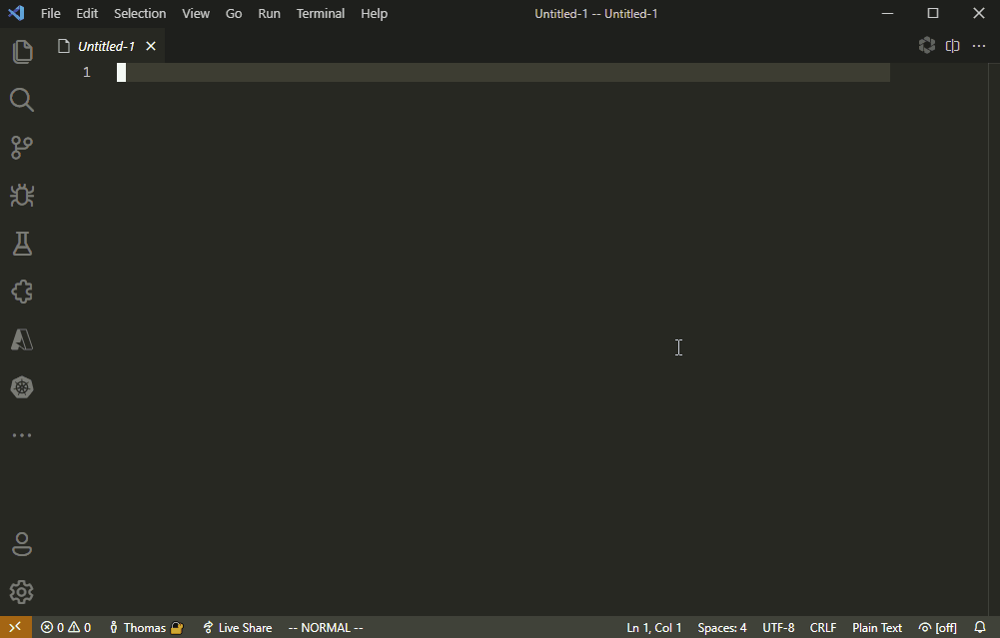

# AdventOfCode2021

<!--  -->
[](https://opensource.org/licenses/MIT)

Having fun during [Advent of Code 2021](https://adventofcode.com/2021) while trying to use F# for the 3rd year. Have a look at other participants and solutions:
[Awesome Advent of Code](https://github.com/Bogdanp/awesome-advent-of-code)

## Run & Test

Make sure you have installed [.Net 6.0](https://dotnet.microsoft.com/download/dotnet/6.0)

```powershell
# Run console program displaying all solutions
dotnet run

# Run tests
dotnet test
```

Or [use a VSCode Dev container](https://code.visualstudio.com/docs/remote/containers).
You only need: Docker, VSCode and [VSCode Remote-Containers extension](https://marketplace.visualstudio.com/items?itemName=ms-vscode-remote.remote-containers)

